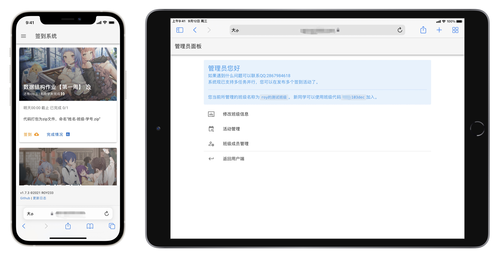
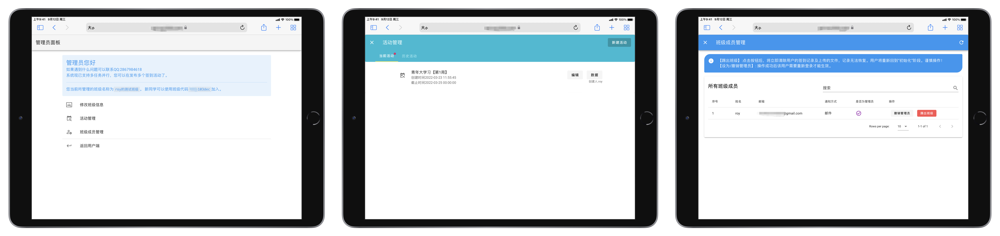
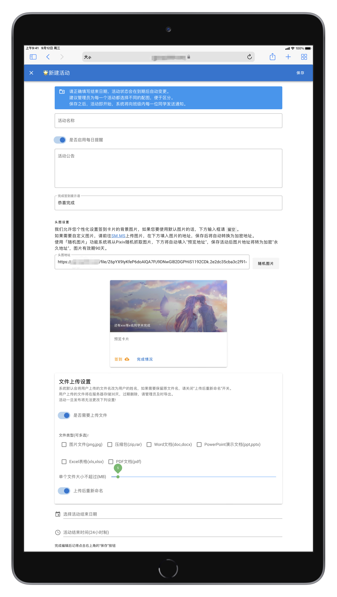
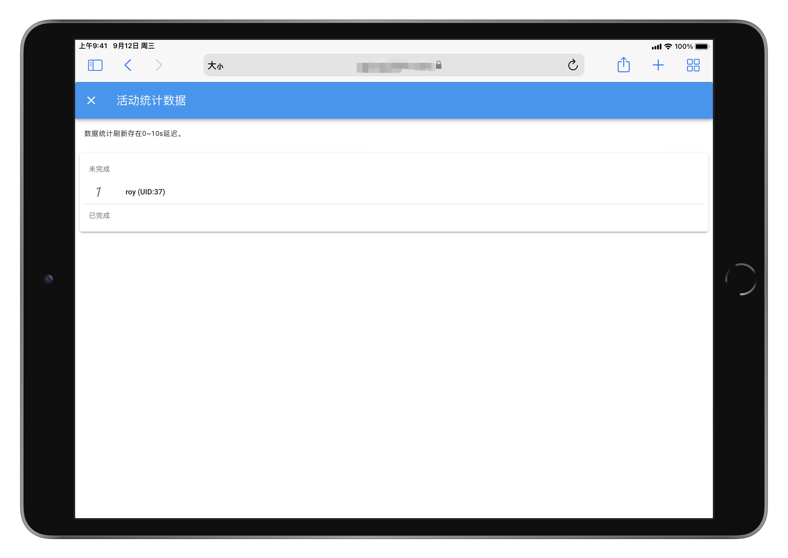
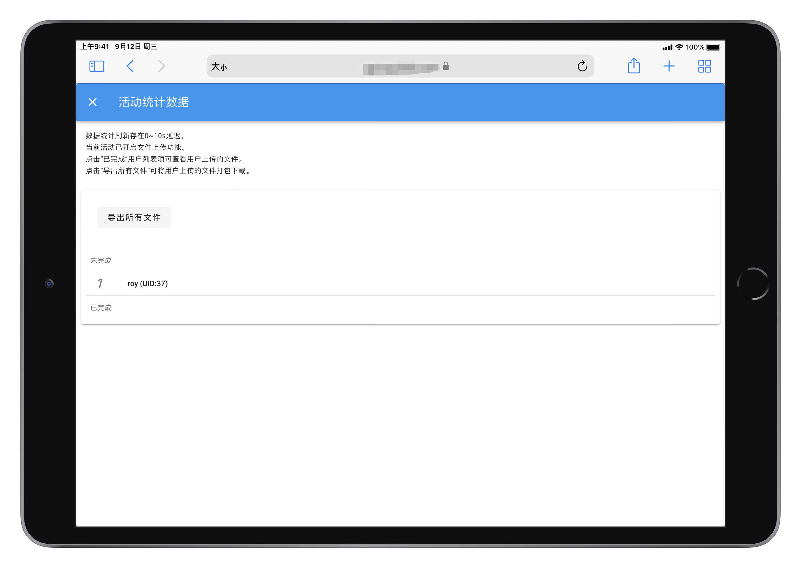

# Sign In Helper

⭐️[配套前端](https://github.com/rroy233/signin-helper-frontend)   🌈  [接口文档](/docs/devDoc.v1.md)  ☕️  [更新日志](CHANGELOG.md)

> 一个为班级成员提供打卡统计和打卡提醒服务的程序

------

## 解决了什么问题

### 对于班级管理者

- 便于统计班级活动参与状况
- 便于文件（如截图、作业等）的收集，收齐后直接打包下载
- 提升班级活动趣味性、班级成员参与感

### 对于班级成员

- 若未完成任务，系统每日将发送提醒。对于一些时间跨度长的活动，避免出现以为自己完成了任务但实际却未完成的情况

### 对比

|              | 😢传统做法                                                    | 🥳使用本平台                                                  |
| ------------ | ------------------------------------------------------------ | ------------------------------------------------------------ |
| 统计完成情况 | 📝按照名单比对/🗣挨个询问                                      | 📊参与情况一目了然                                            |
| 每日提醒     | (❌不现实)                                                    | 邮件/微信 + 中午/晚上 提醒 ⏰                                 |
| 收集文件     | 使用小而美软件，文件缓存不清理，越用越臃肿💢。负责人逐个下载，整理文件麻烦 🤯 | 成员网页上传，管理员打包下载，文件自动命名，整个过程干干净净🤓 |

## 功能

- [x] 活动
  - [x] 多活动并行
  - [x] 自定义活动名称、封面图（自行上传/pixiv随机抓图）、简介等
  - [x] 设定是否需要上传文件
  - [x] 设定活动上传文件的种类、大小等
  - [x] 设定活动结束时间
  - [x] 设定是否开启每日提醒
  - [x] 预览/打包下载用户上传的文件
  - [x] 查看活动参与情况
  - [x] 手动开启/结束活动
  - [x] 临近截止时间，若参与率未达标将给管理员发送提醒
- [x] 用户
  - [x] 创建/加入/退出班级
  - [x] 查看活动参与记录
  - [x] 选择每日提醒推送方式
  - [x] 浏览自己上传的文件
  - [x] 管理员权限/普通用户权限区分，可变更身份
- [x] 通知
  - [x] 邮件推送
  - [x] 微信推送（使用第三方平台接口）
- [x] 文件
  - [x] pixiv抓取的文件（可能有涩图，所以）存储于程序目录
  - [x] 用户上传的文件存储于腾讯云对象存储（cos）
  - [x] 文件代理功能。所有文件访问请求均由`fileHandler`转发/加载
  - [x] 支持格式:jpg,png,pdf,zip,rar等
  - [x] 所有文件均有有效期，过期自动清除
- [x] 其他
  - [ ] 独立的登录/注册功能
  - [x] 推送内含有快捷登录的链接
  - [x] 随机推送模板
  - [x] 用Redis缓存部分计算结果，减轻高并发情况下服务器负载
  - [x] 用户登录状态可吊销

## 程序设计的一些不足

- 工程结构需优化，几乎所有逻辑都在main包
- 日志处理
- ……

##  更多截图

|                          | 截图                                |
| ------------------------ | ----------------------------------- |
| 用户面板                 |  |
| 管理员面板               |  |
| 创建活动                 |  |
| 统计信息（无需上传文件） |  |
| 统计信息（需上传文件）   |  |

## 申请试用

由于该项目为练手项目，目前也未配备独立的登录注册功能，所以自己直接部署将无法正常使用。

如果需要试用请联系Email:oisroy233艾特gmail.com
